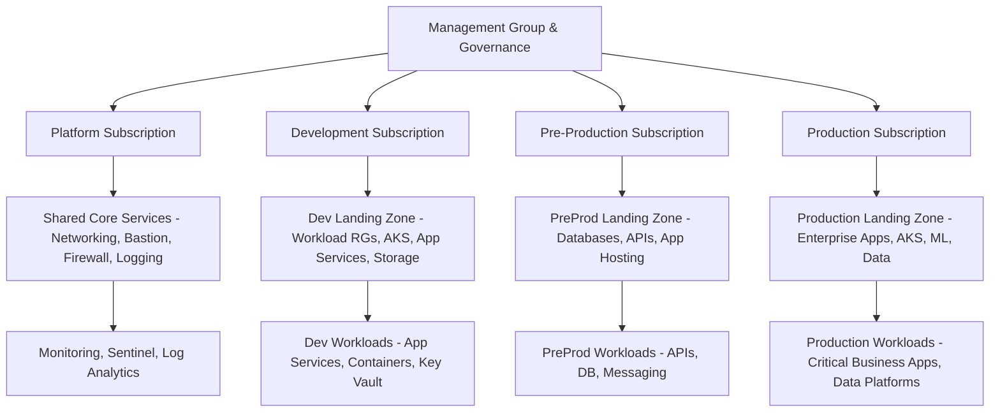

# 🚀 Azure Landing Zone — End-to-End IaC Deployment (Terraform)


---

## 📘 Project Overview

This repository contains a **production-grade, end-to-end Azure Landing Zone** deployment built entirely using **Terraform (IaC)**.  
It follows the **Microsoft Cloud Adoption Framework (CAF)** to deliver a **secure, scalable, policy-driven cloud foundation** for multi-environment workloads — including **Development**, **Pre-Production**, and **Production**.

This project is designed for enterprise cloud environments and demonstrates **real-world Azure architecture** including:

- Governance & Compliance  
- Identity & Access Management (IAM)  
- Secure Networking (Hub-Spoke)  
- Shared Services & Monitoring  
- Environment-specific Workloads  
- DevOps Automation with CI/CD  

---

## 🧠 Tech Stack & Tools

| Component | Technology Used |
|----------|------------------|
| IaC | Terraform v1.9 |
| Cloud Provider | Microsoft Azure |
| Provider Plugin | AzureRM ~>3.100 |
| DevOps | GitHub Actions (CI/CD) |
| Identity | Azure AD / Microsoft Entra ID |
| Networking | VNet, Subnets, NSGs, Azure Firewall |
| Security | Key Vault, RBAC, Azure Policy, Private Endpoints |
| State Mgmt | Azure Storage (Remote Backend) |
| Observability | Log Analytics, Azure Monitor, Sentinel |

---

## 🏗️ Enterprise Architecture

This solution follows a **Hub-and-Spoke Landing Zone Model** to deliver a modular, scalable, and secure Azure foundation:



| Layer             | Purpose                                                        |
| ----------------- | -------------------------------------------------------------- |
| **Management**    | Tenant-wide governance, policies, tagging, and compliance      |
| **Platform**      | Shared services: networking, logging, identity, and monitoring |
| **Landing Zones** | Environment-specific infrastructure (Dev, PreProd, Prod)       |
| **Workloads**     | Applications, containers, data services, and ML workloads      |
```
├── envs/
│   ├── dev/             # Development environment deployment
│   ├── preprod/         # Pre-production environment deployment
│   └── prod/            # Production environment deployment
│
├── modules/
│   ├── core/            # Resource groups, key vault, shared components
│   ├── network/         # VNets, subnets, NSGs, firewalls
│   ├── identity/        # Managed identities, RBAC, role assignments
│   └── governance/      # Policies, management groups, tagging standards
│
├── .github/workflows/   # CI/CD pipelines for Terraform
├── backend.tf.example   # Remote backend state example
└── README.md
```

Key Features 

✅ End-to-End IaC — Complete Azure Landing Zone deployment using Terraform

✅ Multi-Environment — Isolated Dev, PreProd, and Prod with shared governance

✅ Secure Networking — Hub-Spoke VNet, NSGs, and Azure Firewall

✅ Governance & Compliance — Azure Policies, RBAC, and tagging standards

✅ DevOps Ready — GitHub Actions pipeline for plan, apply, and destroy

✅ Secrets Management — Integrated with Azure Key Vault

✅ Extensible — Ready for AKS, App Services, Data Platforms, and AI workloads

⚙️ Deployment Guide
1. 📥 Clone the Repository
git clone https://github.com/sudhir81/Azure-Landing-Zone-End-to-End-IaC-Deployment.git
cd Azure-Landing-Zone-End-to-End-IaC-Deployment

2. 🔐 Authenticate with Azure
az login

3. 🏗️ Deploy Infrastructure

Choose the environment and run:

cd envs/dev       # or preprod / prod
terraform init
terraform plan
terraform apply


💡 Tip: Configure your remote backend using backend.tf.example before the first run.

🤖 CI/CD Pipeline (GitHub Actions)
Workflow	Description
terraform.yml	Runs terraform fmt, validate, plan, and optionally apply on push to main
destroy.yml	Manual workflow to destroy environment resources
Secrets	Store service principal credentials in GitHub Secrets (AZURE_CREDENTIALS_DEV, etc.)

🔧 Optional Enhancements:

Add tflint and checkov for IaC scanning
Add terraform-docs for auto-generating documentation
Enable concurrency in workflows to cancel previous runs automatically

🧩 Terraform Modules Overview
Module	Purpose
core	Resource groups, shared services, Key Vault
network	Hub-Spoke VNet, subnets, NSGs, Azure Firewall
identity	Managed identities, role assignments, RBAC
governance	Policy assignments, management groups, compliance rules

Each module includes inputs, outputs, and usage examples — see their individual README.md files for details.

🔐 Security Best Practices

allow_blob_public_access = false enforced
min_tls_version = "TLS1_2" across services
All modules use least-privilege RBAC principles
Support for private endpoints for sensitive workloads
Integration-ready with Microsoft Defender for Cloud, Azure Sentinel, and Security Center

🗺️ Roadmap

 Add Policy-as-Code (OPA or Rego) integration
 Add Azure Monitor / Diagnostic Settings modules
 Add AKS / App Service deployment examples
 Add Terratest & unit test coverage for modules
 Integrate Checkov, TFLint, and security scanning into pipelines

🧠 Best Practices Followed

✅ Built according to Microsoft Cloud Adoption Framework (CAF) principles
✅ Supports GitOps workflows with Terraform + GitHub Actions
✅ Uses remote state backend with Azure Storage for state management
✅ Modular & scalable — ready for enterprise workloads

📜 License
This project is licensed under the MIT License
.

📞 Contact
👤 Author: Sudhir Dalvi
📧 Email: sudhir.dalvi@hotmail.com

🔗 GitHub: https://github.com/sudhir81

⭐ If this project helps you, please consider starring the repo to support future work!
