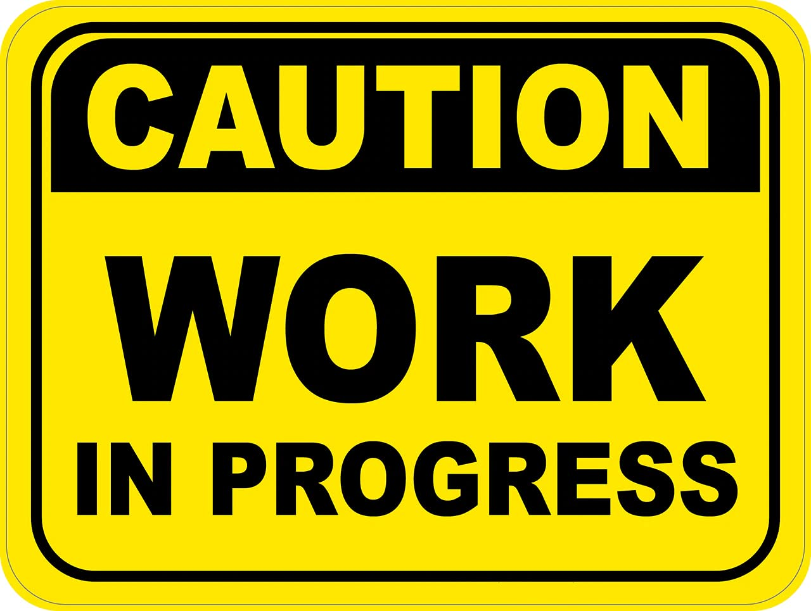
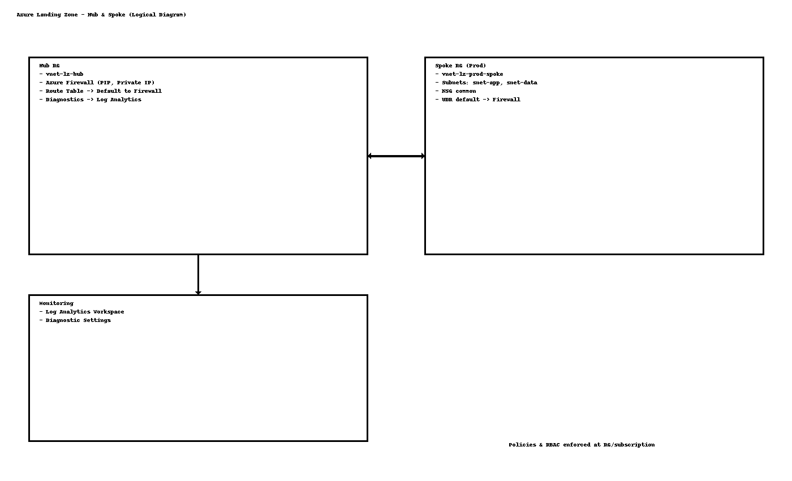

<p align="center">
  
</p>

# 🚀 Azure Landing Zone – End-to-End IaC Deployment (WIP)

This repository provisions a **Minimum Viable Landing Zone (MVLZ)** on Azure using **Terraform**, then layers **governance (Policy)** and **access control (RBAC)**.

## 🧩 What this deploys
- 🌐 **Hub-Spoke VNets** with peering
- 🔥 **Azure Firewall** in Hub + default route from Spoke
- 🧱 **NSGs** and **UDRs**
- 📊 **Log Analytics Workspace** (centralized diagnostics)
- 🛡️ **Azure Policy** (tag enforcement, deny public IPs, audit diagnostics)
- 👥 **RBAC** on Hub/Spoke resource groups

## 📦 Remote State
Remote state is stored in **Azure Storage**:
- Resource Group: `rg-landingzone-tfstate`
- Storage Account: `stlztf2131`
- Container: `tfstate`
- Key: `landingzone/terraform.tfstate`

Configure the backend via:
```bash
terraform init -backend-config=backend.hcl
```

## ▶️ How to deploy
```bash
az login
az account set --subscription "1c95c3eb-55ac-4d47-bee1-e823c941e413"

terraform init -backend-config=backend.hcl
terraform validate
terraform plan -out plan.tfplan
terraform apply plan.tfplan
```

## 🏗️ Structure
```
modules/
  hub/      -> Hub VNet, Firewall, diag
  spoke/    -> Spoke VNet, peering, NSGs, UDRs
  monitor/  -> Log Analytics workspace
  policy/   -> Azure Policy definitions & assignments
  rbac/     -> Role assignments for groups/users
```

## 🧰 CI/CD (GitHub Actions)
- PR: `fmt`, `validate`, and `plan`
- Main: Manual approval before `apply`

> Ensure you add a secret **AZURE_CREDENTIALS** (JSON for a Service Principal with Contributor) or switch to OIDC.

## 🗺️ Architecture
<p align="center">
  
</p>

---

**Status:** Work in progress. Enhancements coming: multiple spokes, Bastion, Private DNS, and diagnostics via DCR/DCE.
